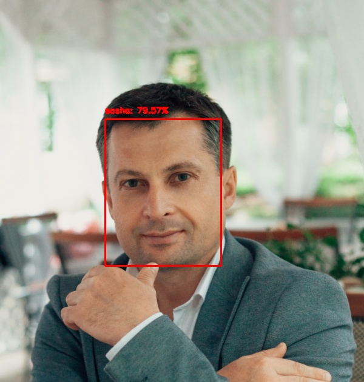
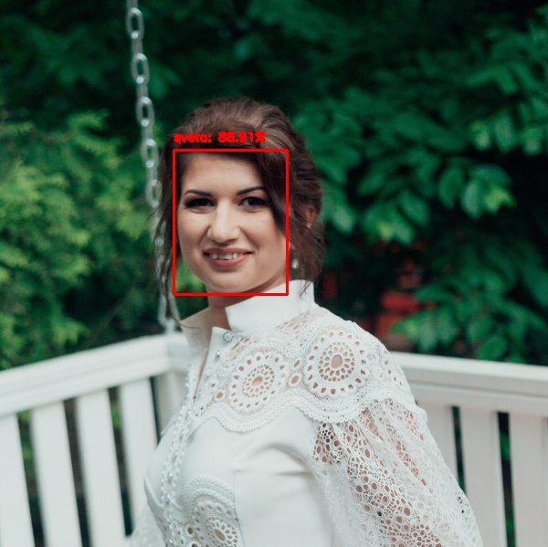

In this project, I developed a system for recognizing my face and the face of my beloved wife Svetlana (kiss!) in the photo.
At the first stage of the pipeline, using a pre-trained face detector based on ResNet, the localization of the face 
in the photo is determined. Next, the face is recognized using the SVM classifier, which was previously trained on 
face embeddings obtained using another FaceNet neural network from the OpenFace project. 

The result of the pipeline is shown in two photos. Instructions for using the scripts are inside the files.

  

  

 
